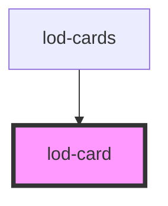

# article-preview

<!-- Auto Generated Below -->

## Properties

| Property       | Attribute        | Description | Type     | Default     |
| -------------- | ---------------- | ----------- | -------- | ----------- |
| `address`      | `address`        |             | `string` | `undefined` |
| `addressUrl`   | `address-url`    |             | `string` | `undefined` |
| `articleTitle` | `article-title`  |             | `string` | `undefined` |
| `date`         | `date`           |             | `string` | `undefined` |
| `description`  | `description`    |             | `string` | `undefined` |
| `imageUrl`     | `image-url`      |             | `string` | `undefined` |
| `readMoreText` | `read-more-text` |             | `string` | `undefined` |
| `readMoreUrl`  | `read-more-url`  |             | `string` | `undefined` |
| `tag`          | `tag`            |             | `string` | `undefined` |

## Dependencies

### Used by

 - [lod-cards](../lod-cards)

### Graph

----------------------------------------------

*Built with [StencilJS](https://stenciljs.com/)*
