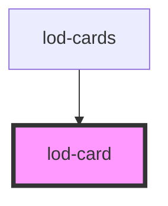

# lod-card

<!-- Auto Generated Below -->

## Properties

| Property       | Attribute        | Description                          | Type     | Default     |
| -------------- | ---------------- | ------------------------------------ | -------- | ----------- |
| `address`      | `address`        | The location address of the event    | `string` | `undefined` |
| `cardTitle`    | `card-title`     | The title of the card                | `string` | `undefined` |
| `date`         | `date`           | The date of the event                | `string` | `undefined` |
| `description`  | `description`    | The card description                 | `string` | `undefined` |
| `imageUrl`     | `image-url`      | Url of the image                     | `string` | `undefined` |
| `readMoreText` | `read-more-text` | Custom read more text                | `string` | `undefined` |
| `readMoreUrl`  | `read-more-url`  | Read more url                        | `string` | `undefined` |
| `tag`          | `tag`            | ; Seperated tags to show in the card | `string` | `undefined` |

## Dependencies

### Used by

 - [lod-cards](../lod-cards)

### Graph

----------------------------------------------

*Built with [StencilJS](https://stenciljs.com/)*
