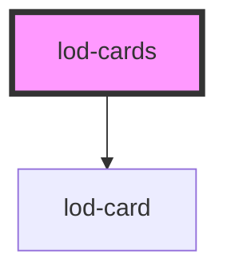

# lod-cards

<!-- Auto Generated Below -->

## Properties

| Property                  | Attribute        | Description                     | Type      | Default     |
| ------------------------- | ---------------- | ------------------------------- | --------- | ----------- |
| `countQuery` _(required)_ | `count-query`    | The count query                 | `string`  | `undefined` |
| `ctaText`                 | `cta-text`       | Custom call to action text      | `string`  | `undefined` |
| `ctaUrl`                  | `cta-url`        | Custom call to action url       | `string`  | `undefined` |
| `endpoint` _(required)_   | `endpoint`       | The SparQL Endpoint             | `string`  | `undefined` |
| `itemsPerPage`            | `items-per-page` | Maximum items per page          | `number`  | `10`        |
| `pagerDisabled`           | `pager-disabled` | Wether to hide the pager or not | `boolean` | `false`     |
| `query` _(required)_      | `query`          | The query                       | `string`  | `undefined` |

## Dependencies

### Depends on

- [lod-card](../lod-card)

### Graph

----------------------------------------------

*Built with [StencilJS](https://stenciljs.com/)*
