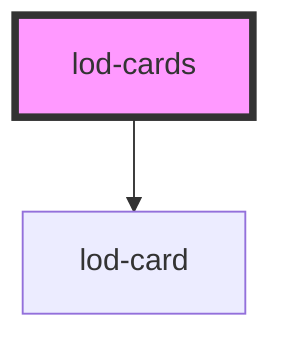

# lod-cards

<!-- Auto Generated Below -->

## Properties

| Property       | Attribute        | Description | Type     | Default     |
| -------------- | ---------------- | ----------- | -------- | ----------- |
| `countQuery`   | `count-query`    |             | `string` | `undefined` |
| `ctaText`      | `cta-text`       |             | `string` | `undefined` |
| `ctaUrl`       | `cta-url`        |             | `string` | `undefined` |
| `endpoint`     | `endpoint`       |             | `string` | `undefined` |
| `itemsPerPage` | `items-per-page` |             | `string` | `undefined` |
| `query`        | `query`          |             | `string` | `undefined` |

## Dependencies

### Depends on

- [lod-card](../lod-card)

### Graph

----------------------------------------------

*Built with [StencilJS](https://stenciljs.com/)*
