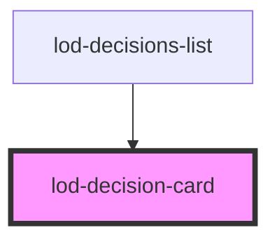

# lod-decision

<!-- Auto Generated Below -->

## Properties

| Property        | Attribute        | Description          | Type     | Default     |
| --------------- | ---------------- | -------------------- | -------- | ----------- |
| `date`          | `date`           | Date of decision     | `string` | `undefined` |
| `decisionTitle` | `decision-title` | Decision title       | `string` | `undefined` |
| `endpoint`      | `endpoint`       | Sparql endpoint      | `string` | `undefined` |
| `organ`         | `organ`          | Organ of decision    | `string` | `undefined` |
| `status`        | `status`         | ; Status of decision | `string` | `undefined` |
| `uri`           | `uri`            | Uri to get decision  | `string` | `undefined` |
| `url`           | `url`            | Decision url         | `string` | `undefined` |

## Dependencies

### Used by

 - [lod-decisions-list](../lod-decisions-list)

### Graph

----------------------------------------------

*Built with [StencilJS](https://stenciljs.com/)*
