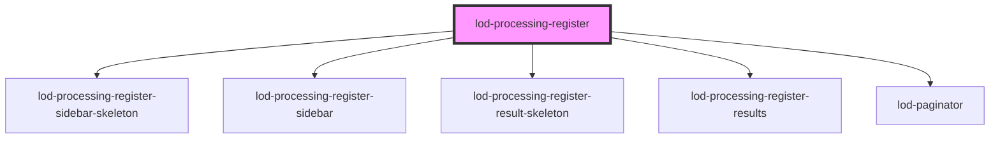

# lod-processing-register-sidebar-skeleton

<!-- Auto Generated Below -->

## Properties

| Property                   | Attribute                       | Description                              | Type     | Default                                                                                    |
| -------------------------- | ------------------------------- | ---------------------------------------- | -------- | ------------------------------------------------------------------------------------------ |
| `itemsPerPage`             | `items-per-page`                | Items that should be shown per page      | `number` | `10`                                                                                       |
| `openDataSoftPublicApiKey` | `open-data-soft-public-api-key` | Custom PUBLIC api key for open data soft | `string` | `"c5e39099e6c0c9d23041ef66b64cf82df92f31f27291836b97d57204"`                               |
| `opendataSoftEndpoint`     | `opendata-soft-endpoint`        | Custom open data soft endpoint           | `string` | `"https://data.stad.gent/api/explore/v2.1/catalog/datasets/verwerkingsregister-stad-gent"` |
| `sparqlEndpoint`           | `sparql-endpoint`               | Custom sparqlEndpoint                    | `string` | `"https://stad.gent/sparql"`                                                               |

## Dependencies

### Depends on

- [lod-processing-register-sidebar-skeleton](components)
- lod-processing-register-sidebar
- [lod-processing-register-result-skeleton](components)
- [lod-processing-register-results](components)
- lod-paginator

### Graph

----------------------------------------------

*Built with [StencilJS](https://stenciljs.com/)*
