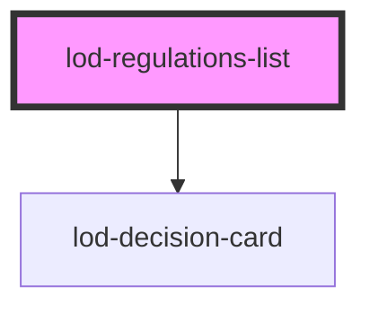

# lod-regulations-list

<!-- Auto Generated Below -->

## Properties

| Property                | Attribute          | Description                        | Type      | Default     |
| ----------------------- | ------------------ | ---------------------------------- | --------- | ----------- |
| `concepts`              | `concepts`         | Concepts                           | `string`  | `undefined` |
| `endDate`               | `end-date`         | End date of the decisions          | `string`  | `undefined` |
| `endpoint` _(required)_ | `endpoint`         | The SparQL Endpoint                | `string`  | `undefined` |
| `governingBodies`       | `governing-bodies` | Governing bodies (bestuursorganen) | `string`  | `undefined` |
| `governingUnits`        | `governing-units`  | Governing Units (bestuurseenheden) | `string`  | `undefined` |
| `itemsPerPage`          | `items-per-page`   | The query                          | `number`  | `5`         |
| `pagerDisabled`         | `pager-disabled`   | Wether to hide the pager or not    | `boolean` | `false`     |
| `startDate`             | `start-date`       | Start date of the decisions        | `string`  | `undefined` |
| `statusses`             | `statusses`        | Statusses                          | `string`  | `undefined` |
| `taxonomy`              | `taxonomy`         | Taxonomy                           | `string`  | `undefined` |
| `types`                 | `types`            | Types                              | `string`  | `undefined` |

## Dependencies

### Depends on

- [lod-decision-card](../lod-decision-card)

### Graph

----------------------------------------------

*Built with [StencilJS](https://stenciljs.com/)*
